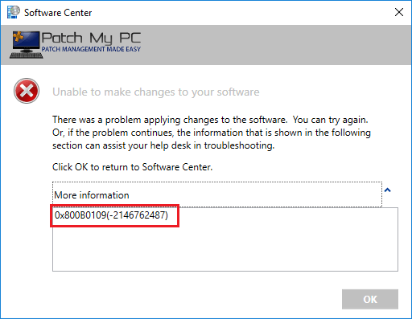
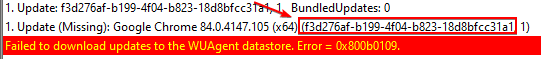
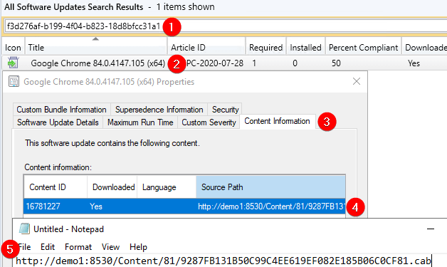
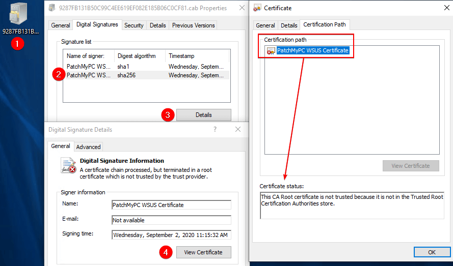
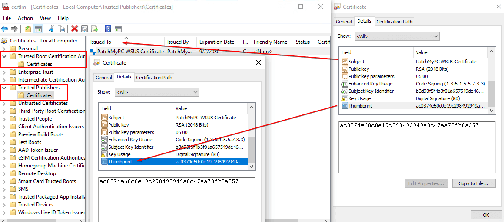
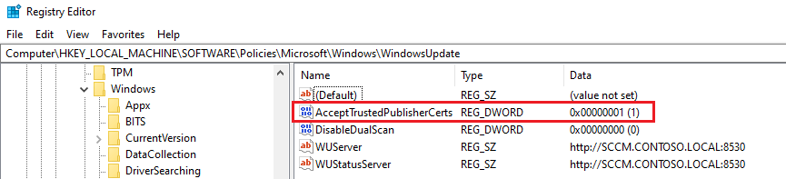

# Third Party Updates Fail To Install With Error 0x800b0109 In SCCM

When attempting to install third-party software updates, you receive error code **0x800b0109** or **0x8024b303.**

### Determine if You are Affected

This error generally will occur when attempting to **install third-party software updates**. You may see the following error in software center based on the **deployment visibility**.

In [WUAHandler.log](https://patchmypc.com/collecting-log-files-for-patch-my-pc-support#update-troubleshooting-client-logs), you will see the following error in the log.

Failed to download updates to the WUAgent datastore. Error = 0x800b0109\
Failed to download updates to the WUAgent datastore. Error = 0x8024b303

If the certificate exists in **Trusted Root**, but not **Trusted Publishers** on the client, you may see the following error instead.

Failed to download updates to the WUAgent datastore. Error = 0x800b0004.

**0x800b0109 = A certificate chain** processed, \*\*but terminated in a root certificate which is not trusted by the trust provider.\*\***0x800b0004 = The subject is not trusted for the specified action.**

This error occurs when a client is attempting to install an update signed by a [**WSUS signing certificate**](../../wsus-signing-certificate-options-for-third-party-updates-in-configuration-manager/) that the client doesn't trust or the **allow third-party updates policy isn't enabled**.

### Step 1: Check if the WSUS Signing Certificate is Deployed to the Client Device

The most common reason error **0x800b0109** or **0x8024b303** occurs is that the specific [**WSUS signing certificate**](../../wsus-signing-certificate-options-for-third-party-updates-in-configuration-manager/) isn't [**properly deployed**](../../how-to-deploy-the-wsus-signing-certificate-for-third-party-software-updates/) to the client device. The signing certificate needs to be in the **Trusted Root** and **Trusted Publishers** certificate store.

It's important to review the certificate used to sign the **specific update failing** as we often see the failing update was signed using a previous certificate that may not be deployed to clients. To find the certificate used for the update perform the following actions:

**1.** Get the **UpdateID** for the update failing. The **UpdateID** can be found in the line before the error message in the **WUAHandler.log**.

**2. Download** the update CAB file using the Configuration Manager console. Navigate to **All Software Updates** > **Search UpdateID** > **Properties** of **Update** > **Content Information** tab > **Ctrl + C** to copy the **Source Path** > **Paste** to Notepad and remove non-URL text

3\. **Download** or **copy** the .CAB file to the client receiving error **0x800b0109 / 0x8024b303**. On **properties** of the file, review the **Certification Path** tab, and review if there are any trust errors.

If the certificate shows any **trust errors**, you will need to [**deploy this certificate to all client devices**](../../how-to-deploy-the-wsus-signing-certificate-for-third-party-software-updates/).

**4.** If the certificate appears to be **trusted** and **valid**, you should next validate the certificate exist in both the **Trusted Root** and **Trusted Publishers** certificate store on the client.

**4.1** Take note of the **thumbprint** of the WSUS signing certificate from the **Details** tab of the .CAB file as shown in **step 3**. Open **certlm.msc** on the client receiving the error and check if the certificate exists in both **Trusted Root** and **Trusted Publishers** certificate stores by checking the **subject name** and **thumbprint**.

**4.2** If the certificate appears is installed in both **Trusted Root** and **Trusted Publishers**, and you still receive **0x800b0109 / 0x8024b303**, you also need to validate the setting [Allow signed updates for an intranet Microsoft update service location](third-party-updates-fail-to-install-with-error-0x800b0109-in-sccm.md#step3) is enabled and deployed.

> **Important:** We often see cases where the **WSUS signing certificate is updated**, and **only** the **newest WSUS signing certificate** is deployed to the client. If there where any updates signed using a previous certificate, that certificate also needs to be deployed to client devices, or **updates published before the new certificate was created** will fail with error **0x800b0109**.

### Step 2: Check policy: Allow signed updates for an intranet Microsoft update service location

If the certificate appears to be installed in **Trusted Root** and **Trusted Publishers** on the client, and you still receive error **0x800b0109** or **0x8024b303**, it's likely due to the policy [Allow signed updates for an intranet Microsoft update service location](https://docs.microsoft.com/en-us/mem/configmgr/sum/deploy-use/third-party-software-updates#enable-third-party-updates-on-the-clients) not being enabled.

To check if the policy is enabled perform the following actions:

**1.** Open regedit.exe, and navigate to: **HKLM\SOFTWARE\Policies\Microsoft\Windows\WindowsUpdate:AcceptTrustedPublisherCerts=1 | (REG\_DWORD)**. If enabled, you will see the RegValue **AcceptTrustedPublisherCerts** set to **1** as a **REG\_DWORD**

**2.** If the value isn't set, **updates will fail to install** with error **0x800b0109**. You can use a [**Configuration Manager client setting**](../../how-to-deploy-the-wsus-signing-certificate-for-third-party-software-updates/#clientsetting) or [**group policy**](https://patchmypc.com/scupcatalog/documentation/CertificateAndGPODeploymentGuide.pdf) to deploy this policy to devices.

> **Important:** Please ensure that the '**Type**' of the RegValue is '**REG\_DWORD**' and **NOT** '**REG\_QWORD**'

### Step 3: Check if 0x800b0109 is a Scan Error, not an Update Install Error

We periodically have customers mistakenly think that error **0x800b0109** is happening when installing third-party updates, but it's actually occurring when trying to **scan against the WSUS server**.

If WUAHandler.log contains the error below containing the words **OnSearchComplete** or **Scan failed,** then your issue is actually related to the client not trusting the SSL certificate used by the WSUS server.

OnSearchComplete - Failed to end search job. Error = 0x80244010. Scan failed with error = 0x80244010.

To resolve the error in this scenario, you will need to install the [**Root Certificate Authority**](https://en.wikipedia.org/wiki/Certificate_authority) for the CA that issue the SSL certificate to the WSUS server on the client. One option to do this is using [**Group Policy**](https://docs.microsoft.com/en-us/windows-server/identity/ad-fs/deployment/distribute-certificates-to-client-computers-by-using-group-policy).

### Video Resolution Guide for Error 0x800b0109

To resolve error code **0x800b0109 / 0x8024b303,** you need to distribute the WSUS signing certificate to the **Trusted Root** and **Trusted Publishers** certificate stores on your client devices.

We also have a detailed step-by-step video guide below that covers deploying the WSUS signing certificate using SCCM 1806+ or using group policy to **resolve error 0x800b0109 on your clients.**

If you prefer a non-video format, you can use the following guides to distribute the WSUS signing certificate:

* [Third-party software updates feature in SCCM 1806+ - (Microsoft Docs)](https://docs.microsoft.com/en-us/mem/configmgr/sum/deploy-use/third-party-software-updates#enable-third-party-updates-on-the-sup)&#x20;
* [**Deploy the certificate using group policy - (PDF Guide)**](../../scupcatalog/documentation/CertificateAndGPODeploymentGuide.pdf).
