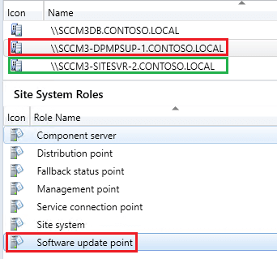

Since the release of Configuration Manager 1806, some customers report that the [WSUS signing certificate](/wsus-signing-certificate-options-for-third-party-updates-in-configuration-manager) isn't being populated in the **Third Party Updates tab** of the software update point. It occurs even when the option **Configuration Manager manages the certificate** is enabled.

## Configuration Manager Manages the Certificate Overview

The option to have **[Configuration Manager manages the certificate](https://docs.microsoft.com/en-us/mem/configmgr/sum/deploy-use/third-party-software-updates#automatically-manage-the-wsus-signing-certificate)** will allow ConfigMgr to create a self-signed WSUS signing certificate or to **[deploy an existing signing certificate](https://patchmypc.com/how-to-deploy-the-wsus-signing-certificate-for-third-party-software-updates#topic1)**.

More details about the option to **Automatically manage the WSUS signing certificate** can be found on **[Microsoft Docs](https://docs.microsoft.com/en-us/mem/configmgr/sum/deploy-use/third-party-software-updates#automatically-manage-the-wsus-signing-certificate)**

## Why's Does This Option Not Work?

The most common reason why the WSUS signing certificate doesn't automatically get generated during a software update point synchronization (wsyncmgr.log) is that the software update point site system role is remote from your site server and the [remote WSUS server isn't configured for HTTPS](https://docs.microsoft.com/en-us/mem/configmgr/sum/deploy-use/third-party-software-updates#additional-requirements-when-the-sup-is-remote-from-the-top-level-site-server).

For example, in the screenshot below **SCCM3-DPMPSUP-1** is our Software update point and it's remote from the primary site server **SCCM3-SITESVR-2**

When your software update point is remote from your site server, the option **Configuration Manager managed the certificate** will only work if the WSUS/SUP is configured for HTTPS/SSL as described in the [Microsoft Docs](https://docs.microsoft.com/en-us/mem/configmgr/sum/deploy-use/third-party-software-updates#additional-requirements-when-the-sup-is-remote-from-the-top-level-site-server).

If the WSUS server doesn't have a [web server certificate](https://docs.microsoft.com/en-us/sccm/core/plan-design/network/pki-certificate-requirements#BKMK_PKIcertificates_for_servers) and hasn't been properly [enabled for SSL](https://docs.microsoft.com/en-us/previous-versions/system-center/configuration-manager-2007/bb633246\(v=technet.10\)), you will see the following warning in the [wsyncmgr.log](https://docs.microsoft.com/en-us/mem/configmgr/core/plan-design/hierarchy/log-files#BKMK_SUPLog) during a synchronization.

**Warning: Remote WSUS connection is not HTTPS. This prevents software update point from getting the signing certificate for third-party updates.**

## Possible Resolutions for SUP not in HTTPS Mode with this Option Enabled

You have two options to work around this issue:

#### **Option 1:** Manage the WSUS signing certificate manually

The first workaround is to create a self-signed or import a PKI-based code-signing certificate for the WSUS Signing Certificate using our [Publishing Service](https://patchmypc.com/publishing-service-setup-documentation) and deploy the certificate to clients using an alternative method mentioned [how to deploy the WSUS signing certificate](https://patchmypc.com/how-to-deploy-the-wsus-signing-certificate-for-third-party-software-updates). If you choose this method, you can change the option to **Manually manage the certificate** in SCCM.

This option will generally be the most straightforward because you won't need to request a web server certificate for WSUS and configure [WSUS to use SSL](https://docs.microsoft.com/en-us/previous-versions/system-center/configuration-manager-2007/bb633246\(v=technet.10\)). The one disadvantage to this option is clients won't have the WSUS Signing Certificate automatically deployed to their Trusted Root and Trusted Publishers certificate store natively using the SCCM [client setting](https://docs.microsoft.com/en-us/mem/configmgr/sum/deploy-use/third-party-software-updates#enable-third-party-updates-on-the-clients) to enable third-party updates.

#### **Option 2:** Switch Software Update Point to HTTPS

Configure the WSUS/SUP to use SSL/HTTPS to use the built-in option for Configuration Manager manages the certificate. Here are some resources that may help configure WSUS to use SSL.

[\- PKI certificate requirements for System Center Configuration Manager](https://docs.microsoft.com/en-us/sccm/core/plan-design/network/pki-certificate-requirements)

[\- How to Configure the WSUS Web Site to Use SSL](https://docs.microsoft.com/en-us/windows-server/administration/windows-server-update-services/deploy/2-configure-wsus#25-secure-wsus-with-the-secure-sockets-layer-protocol)

\- [How To Configure Microsoft SCCM to Use HTTPS/PKI](https://blogs.technet.microsoft.com/jchalfant/how-to-configure-microsoft-sccm-to-use-https-pki/)
