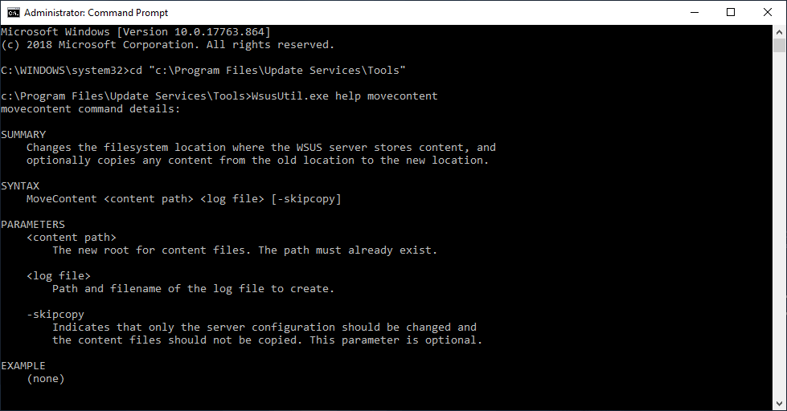
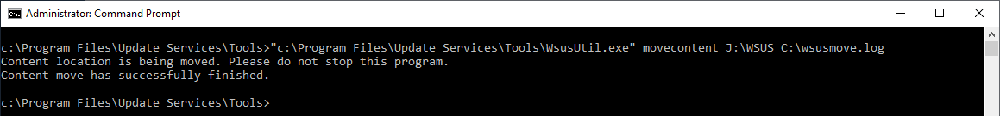
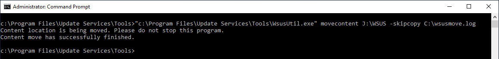
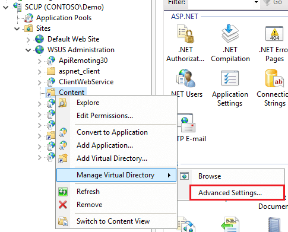
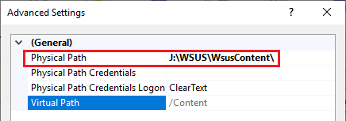
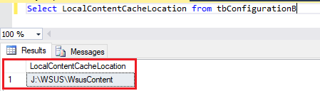
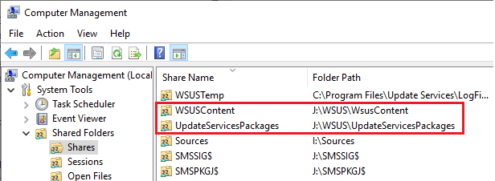

The WSUSContent folder is where WSUS stores information regarding Microsoft software update EULA's, third-party software update content, and Microsoft update content when using WSUS standalone without SCCM.

There are a few reasons why you may want to move the WSUSContent folder to a new location, including:

- Low disk space on the current volume

- Corrupted or misconfigured shares for (WsusContent, UpdateServicesPackages, or WSUSTemp)

## How to Use WSUSUtil.exe to Move the WSUSContent Folder to a New Location

To move the WSUSContent folder to a new location, you will need to use the **WSUSUtil.exe** tool located in the **C:\\Program Files\\Update Services\\Tools** directory. In our example, we will move the WSUSContent folder from **C:\\WSUS** to **J:\\WSUS**

Here is a list of available command lines for **WSUSUtil.exe**:

There are two possible options you can use when moving the WSUSContent folder:

The first option is to move file's in the current WSUSContent folder to the new location. We recommend using this option if you have already published third-party software updates to your WSUS server and want to migrate those published updates.

**Example:** "C:\\Program Files\\Update Services\\Tools\\WsusUtil.exe" movecontent **J:\\WSUS** C:\\WSUSmove.log

The second option includes the -skipcopy parameter and does not copy the existing file's in the current WSUSContent folder to the new location. This option can save time if you haven't published any third-party updates before or don't want to migrate previous content.

**Example:** "C:\\Program Files\\Update Services\\Tools\\WsusUtil.exe" movecontent **J:\\WSUS** -skipcopy C:\\WSUSmove.log

## Validate WSUSContent Move was Successful

There are three different places where the WSUSContent configuration is utilized. If configured correctly, **all these locations should point to the same path**.

1. In the registry on the WSUS server, HKEY\_LOCAL\_MACHINE\\Software\\Microsoft\\Update Services\\Server\\Setup:**ContentDir**
    - 
        

3. In IIS > Sites > WSUS Administration > **Content**
    - 
        
    
    - 
        

5. In **SQL Server Management Studio**, run the following query against the **SUSDB** run the following query: **Select LocalContentCacheLocation from tbConfigurationB**
    - 
        

7. In **Computer Management**, review the **Shared Folders** node and validate the **Folder Path**
    - 
        

## How to Use WSUSUtil.exe to Move the WSUSContent Folder to a New Location (Video)

If you would like to watch the video guide, this goes into a more detailed explanation about how to move the WSUSContent folder, and all the locations to validate, including the registry, IIS, shared folders, and the SUSDB.

<iframe src="https://www.youtube.com/embed/VGghMPxJl6A" width="560" height="315" frameborder="0" allowfullscreen="allowfullscreen" data-cookieconsent="ignore"></iframe>
