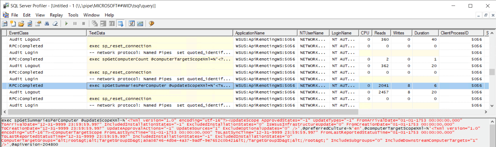

Windows Server Update Services (WSUS) administrators may occasionally encounter a puzzling scenario where the Installed / Not Applicable column percentages exceed 100%. This anomaly can be confusing and lead to questions about data compliance integrity .


## Determine if You are Affected

In a standalone WSUS configuration, where the Configuration Manager Software Update Point (SUP) site system role is not configured, administrators rely on the WSUS console for reporting.

To analyze update compliance for individual computers, follow these steps:

1. Open the WSUS Console

3. Navigate to the "All Computers" node or a specific Computer Group. The computer status summary will display multiple columns, some of which may be hidden by default.

5. Right-click any column header and select additional columns to include:
    - **Installed/Not Applicable Percentage – Displays the percentage of updates that are installed out of those marked as applicable.**
    
    - Needed Count - The number of updates that are required but not installed.
    
    - Installed Count - The number of updates that are applicable and are installed.
    
    - Failed Count - The number of updates that attempted installation but failed.
    
    - Not Applicable Count - The number of updates that are not applicable.


When reviewing these columns, you may notice that in some cases, the Installed/Not Applicable (%) column exceeds 100%. This anomaly can cause confusion regarding update compliance and is typically the result of WSUS miscalculating the percentage based on update applicability rules.

You might expect that the Installed/Not Applicable Percentage value for each computer is calculated the following way:-

**Installed + Not Applicable / (Installed + Needed + Not Applicable) \* 100**


In this example, for computer cm2.lab2.local, that would be 5 + 159 / (5 + 2 + 159) \* 100 = 99%  
But instead of 99% it indicates the Installed/Not Applicable percentage is 110%

**The reason this occurs is because the Not Applicable count data is not summarised correctly for some computers.**

## Cause

We can see the summarization data that causes the anomoly by viewing data in the **tbComputerSummaryForMicrosoftUpdates** table.


A negative value in the unknown column is still counted and contributes to the Not Applicable count. Executing the Stored Procedure **dbo.spGetSummariesPerComputer** indicates this further. Specifically, data that has a **SummarizationState** of zero.


**dbo.spGetSummariesPerComputer** is actually called to display the summary data in the WSUS console. You can see this if you run SQL Profiler and refresh the view in the WSUS console. Here is an example of an XML passed to the Stored Procedure



```
<?xml version="1.0" encoding="utf-16"?><UpdateScope ApprovedStates="-1" UpdateTypes="-1" FromArrivalDate="01-01-1753 00:00:00.000" ToArrivalDate="12-31-9999 23:59:59.997" IncludedInstallationStates="-1" ExcludedInstallationStates="0" IsWsusInfrastructureUpdate="0" FromCreationDate="01-01-1753 00:00:00.000" ToCreationDate="12-31-9999 23:59:59.997" UpdateApprovalActions="-1" UpdateSources="-1" ExcludeOptionalUpdates="0" />'
```

The Stored Procedure creates various temporary tables and filters updates incorrectly based on Summarization States - which is the cause for the miscalculations outlined in this KB. Summarization inconsistencies can occur when clients report on update states for updates that have been declined/deleted since their last scan/report time.

## Resolution

WSUS includes another Stored Procedure that can reset the summary data in this scenario. **spResetOnlineSummaryTables** calculates update status summaries across all computers by counting updates by state (Unknown, NotInstalled, Downloaded, Installed, Failed, InstalledPendingReboot). To execute this Stored Procedure using SQL Server Management Studio (SSMS):-

1. Open SQL Server Management Studio (SSMS)

3. Connect to your SQL Server instance

5. Enter your server name and authentication details

7. Click "Connect"

9. Navigate to the stored procedure in Object Explorer

11. Expand "Databases"

13. Expand "SUSDB"

15. Expand "Programmability"

17. Expand "Stored Procedures"

19. Find **dbo.spResetOnlineSummaryTables** in the list

21. Right-click on **dbo.spResetOnlineSummaryTables**

23. Select "Execute Stored Procedure"

25. Click "OK"


The summarization of the data should now reflect accuratly in the WSUS console. Below is a **Before (1)** and **After (2)** when running the Stored Procedure. In this example, 17 counts have been removed from some rows which now results in an accurate compliance calcualtion.


**Note:** Deleting individual computers from the WSUS console will also fix the problem on a per-computer basis. When the computer reports back in, the compliance will be accurately reflected in the Installed / Not Applicable column.
