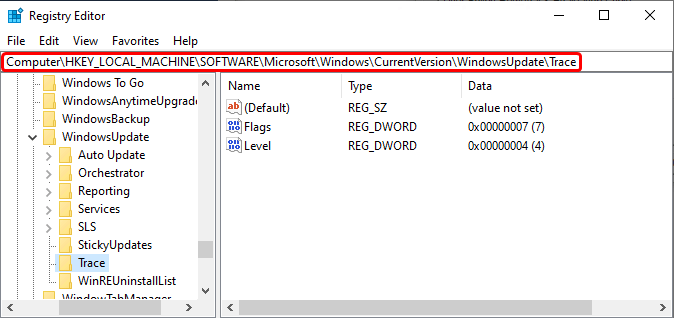
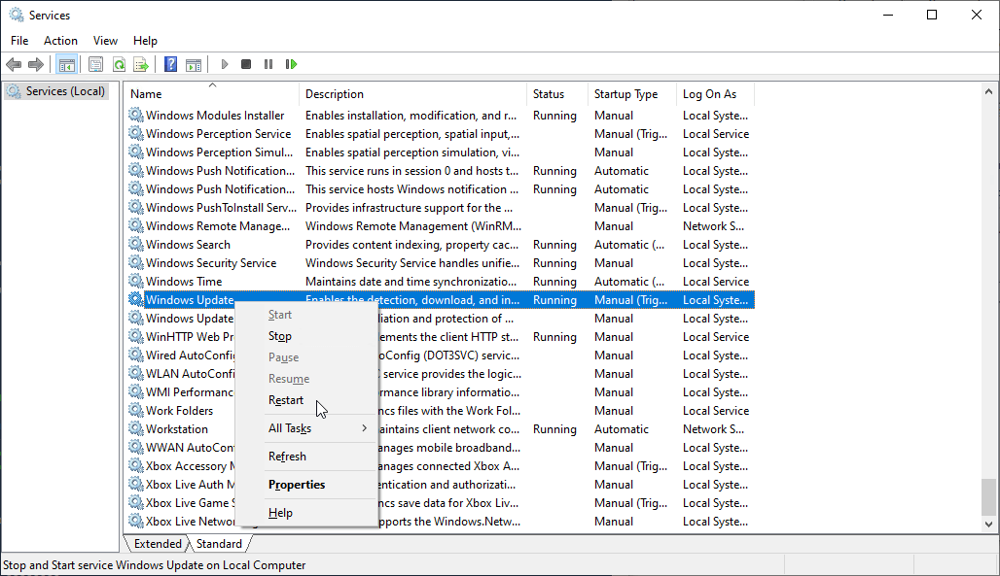
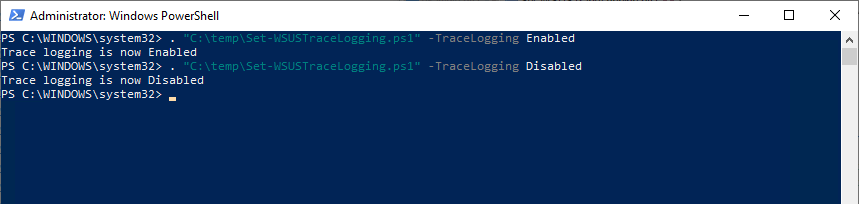

In this article, we will discuss how to enable trace logging for the Windows Update Agent on a Windows device. This can also be considered debug, or verbose logging. With this enabled the WindowsUpdate.log file, and the corresponding event logs will contain more information which is helpful for troubleshooting.

> **Note:** Modifying REGISTRY settings incorrectly can cause serious problems that may prevent your computer from booting properly. Patch My PC cannot guarantee that any problems resulting from the configuring of REGISTRY settings can be solved. Modifications of these settings are at your own risk.

## Enable trace logging manually

First, a registry key must be created at the location **HKEY\_LOCAL\_MACHINE\\SOFTWARE\\Microsoft\\Windows\\CurrentVersion\\WindowsUpdate\\Trace**. The WindowsUpdate key should already exist, but the Trace key will need to be created.

Once this is created two **REG\_DWORD** values must be made as noted below, and also shown in the picture above.

- Flags = 7

- Level = 4

Lastly, the Windows Update service must be restarted. This can be done in many ways. The services MMC method is shown below by simply right-clicking the **Windows Update** service and selecting restart.

## Enable trace logging with a PowerShell snippet

A script is available on GitHub [here](https://github.com/PatchMyPCTeam/CustomerTroubleshooting/blob/Release/PowerShell/Set-WSUSTraceLogging.ps1) to perform the registry edits and restart the service for both enabling and disabling the trace logging. An example of running the script is shown below. The [execution policy](https://docs.microsoft.com/en-us/powershell/module/microsoft.powershell.core/about/about_execution_policies?view=powershell-7.2) may need to be adjusted depending on the configuration of the device the script is being run on.

. "C:\\temp\\Set-WSUSTraceLogging.ps1" -TraceLogging Enabled

> **Note:** Once you have enabled or disabled trace logging you can collect the logs using the Get-WindowsUpdateLog PowerShell cmdlet, or review the event logs. More information regarding the Windows Update logs can be found within the Microsoft documentation found [here](https://docs.microsoft.com/en-us/windows/deployment/update/windows-update-logs).
